# Irrigation Prediction Application – User Guide

## Table of Contents TODO: update structure accordingly
1. [Introduction](#introduction)
2. [System Requirements](#system-requirements)
3. [Installation](#installation)
   - [Sensor preparation](#sensors-preparation)
4. [Setup and Configuration](#setup-and-configuration)
5. [Using the Application](#using-the-application)
   - [Connecting Sensors](#connecting-sensors)
   - [Training the Prediction Model](#training-the-prediction-model)
   - [Adjusting Settings](#adjusting-settings)
6. [Understanding Predictions](#understanding-predictions)
7. [Troubleshooting](#troubleshooting)
8. [FAQ](#faq)

---

## Introduction
The **Irrigation Prediction Application** optimizes agricultural water management by leveraging real-time data from soil moisture sensors via the **WaziGate IoT platform**, employing **predictive analytics** to **minimize water waste** and **enhance crop yields.**

The Wazigate is a **LoRa Gateway.** It is the connecting link between your **sensor devices and the WaziCloud platform**. It merges and stores all the sensor values and also can **run custom applications**. 

&nbsp;<p style="text-align: center;">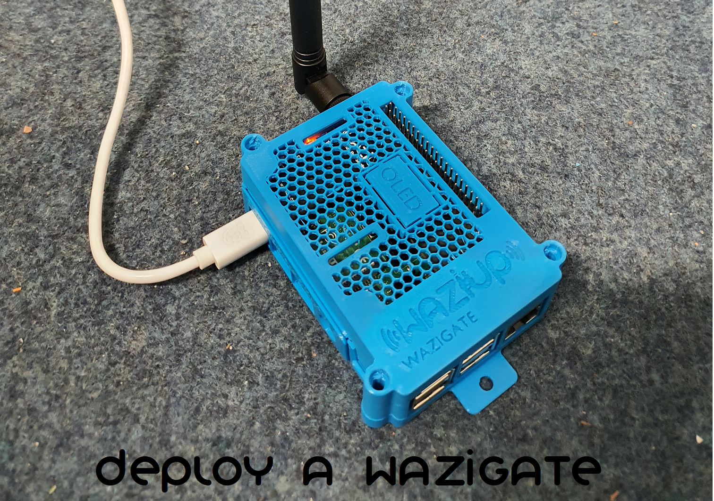</p><p style="text-align: center;"> Figure : </p> 

## System Requirements
- **Supported OS:** WaziGateOS
- **Required Hardware:** WaziGate, soil moisture sensor(s), temperature sensor(s)
- **Optional Hardware:** Actuation with a **flow meter and a pump actuated with relay** or **flow meter coupled with a  solenoid valve**, to conduct the automatic irrigation
- **Software Dependencies:** None, comes as docker container with all dependencies included
- **Internet Connection:** **Required** for retrieving weather data, model updates and remote maintenance.


## Setup and Installation of the WaziGate

### Connect the WaziGate to a local wifi network

This section explains how to connect the WaziGate to local Wi-Fi or how to use the device’s hotspot if necessary.

For this application to work properly, an internet connection is needed

1. Power the WaziGate with the delivered power supply and wait for 3min.
2. Connect your smartphone or PC to a WIFI with the following SSID: `WAZIGATE_XXXXXXXXX` (X is arbitrary). The password for this network is `loragateway`. Your device may state that this network has no internet connection, but connect anyways.
3. Open the browser of your choice, type the address [http://10.42.0.1](http://10.42.0.1) as URL and hit enter or scan this QR code. <p style="text-align: center;"></p> <p style="text-align: center;"> Figure : </p> 
4. The login screen of the WaziGate is shown. Use the following credentials:
   - **Username:** `admin`
   - **Password:** `loragateway`
5. Next step is to connect to a local Wifi with internet access: Go to Settings -> Wifi. The WaziGate will now scan for local networks nearby. 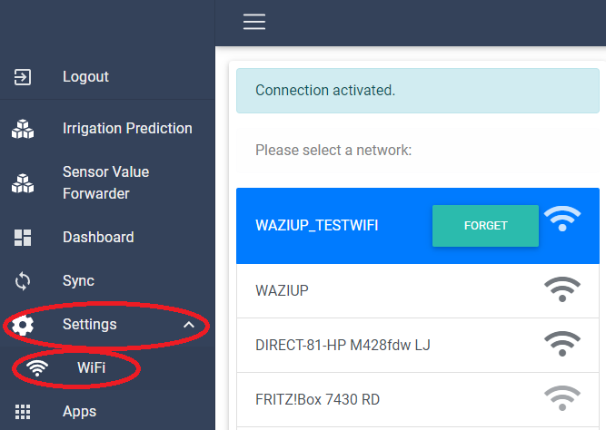<p style="text-align: center;"> Figure : </p> 
6. To connect to your Wifi, you have to issue the password of your network.
7. After connecting, the UI is not any more responsive and the access point of the WaziGate will be closed. Now connect your device (smartphone, pc or tablet) to the same network like you formerly connected your WaziGate.
8. Now you can access the WaziGate via the IP-address (`http://<ip address>`), via the alias [http://wazigate.local](http://wazigate.local) or scan just this QR code. <p style="text-align: center;"></p><p style="text-align: center;"> Figure : </p> 

The last two options are only available if there is only one WaziGate connected to the same Wifi network.

### Connect the WaziGate via GSM modem 

If there is no local wifi available there is also the option to use a `USB GSM modem` with a SIM card to connect the gateway. There are many available options on the market, use a self hosted device that is detected as a ethernet card. It should be plug and play. 

It is suggested to run the setup and installation of apps via wifi or via the provided hotspot of the gateway, in order to be able to connect from everywhere via the remote tunnel or the vpn.

### Install the irrigation prediction application

The application needs to be manually installed on the WaziGate, in order to use it. In the following, the process of app installation is explained, on how to download/install the application from dockerhub.

1. Access the GW: http://wazigate.local or if you are aware of the assigned ip address, type: `http://<ipaddress>`, afterwards login with the given credentails.
2. In the side menu, go to the App section.
3. Press the `+` button.
4. Click the option: `INSTALL` in the yellow `Install a Custom App` tile.
5. A textfield dialog will appear, type: `waziup/irrigation-prediction:latest` click install and wait. 
6. Press `Launch the App`. 
7. In the `Apps` section: in the `Irrgiation Prediction` App tile, click on 
`SETTINGS`. 
8. In Settings press the dropdown to the left of the `UNINSTALL` button, 
select here the option: `Always`.

All dependencies are included in the docker image, so no further actions are required.

### Change LoRa frequency of the WaziGate

In this section we are covering the steps involved of changing the LoRa frequency of the WaziGate, it is possible in a range of 433-915Mhz, keep in mind that you always have to have the compatible antenna as otherwise you will experience bad reception and poor range.

**Steps:**
1. Connect to the Wazigate via ssh (**user:** `pi@wazigate.local`, **pw:** `loragateway`) 
2. Navigate to:
`cd /var/lib/wazigate/apps/waziup.wazigate-lora/chirpstack-network-server`
3. Open the file with the editor of your choice, we
going to use `nano` in this example:
`sudo nano chirpstack-network-server.toml`
4. Change the following line as you desire:
```
[network_server.band]
name=”EU868”
```
5. Reboot the gateway, issue `sudo wazi-config`
and select `“Reboot Wazigate”`

## Soil Sensor
The soil sensors are LoRa enabled arduino microcontrollers with attached sensors housed in a waterproof case, powered by a solar panel. 

&nbsp;<p style="text-align: center;">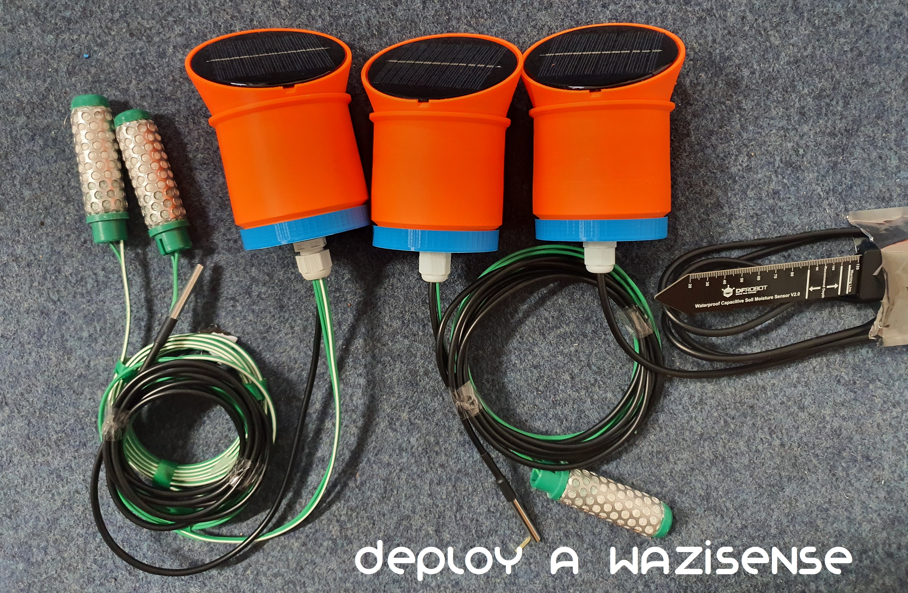</p>
<p style="text-align: center;"> Figure : WaziSense V2 with different sensor configuration.</p> 

For the purpose of developing IoT solutions and testing them, we developed a new version of the development board “WaziSense”. This board will be used in the development and testing of the minimum viable products prosed hereafter. It is capable of supporting harsh outdoor environments. The WaziSense is an all-in-one style development board for projects involving outdoor sensing and agricultural purposes. 

Fitted with a LoRa sx1276 chip, it can communicate with a LoRa enabled gateway over long distances. It has terminal connectors which make it easy to hookup peripherals and deploy outdoor solutions with ease. This second version of the board has better energy control and optimization, aligning with our commitment to sustainability and resource conservation. It includes a Maximum Power Point Tracking (MPPT) solar charge controller. This enhancement eliminates the need for extra hardware to connect a solar panel and rechargeable battery, simplifying the setup process.

### How to build the sensor devices

The WaziSense V2 can support different types of sensors and actuators. In the irrigation use-case we constructed 3 different device configurations:
- **WaziSenseV2** + **1x Watermark** 200SS (soil tension sensor) + **DS18B20** (soil temperature sensor)
- **WaziSenseV2** + **2x Watermark** 200SS (soil tension sensor) + **DS18B20** (soil temperature sensor)
- **WaziSenseV2** + **1x SEN0308** (capacitive soil moisture sensor)

#### What parts are required?

The following the needed hardware is presented that is required in order build a soil device:

&nbsp;<p style="text-align: center;"></p>
<p style="text-align: center;"> Figure : WaziSense V2 assembly</p> 

**Components:**
- WaziSense V2 Board
- 868 Mhz dipole Antenna
- Wires and jumpers
- Irrometer Watermark Sensor 200SS
- DS18B20 temperature sensor 
- 10 kOhm resistor, for the Watermark
- 4.7 kOhm resistor, for the DS18B20
- Waterproof WaziSense casing (contact us) or custom case
    - cable glands
    - seals
- FTDI connector + USB cable
- Power:
    - Solar panel 6 V, 1 W 
    - 18650 3,7V Li-Ion battery
    - 18650 battery holder

We created an in depth guide on how to build a sensor device on [WaziLab.](https://app.wazilab.io/courses/9imspUTdc--?topic=2NV8AmAstXa)

### How to connect soil sensor devices to the WaziGate

The connection between the sensor devices and the WaziGate is being realized via LoRa. The activation procedure is done via Activation By Personalization (ABP). When using ABP to connect sensor devices to a WaziGate via LoRa, you must hardcode specific keys and addresses like:
- `Device Addresses`
- `Network Session Keys`
- `App Key` 

directly into the microcontroller's firmware. Unlike OTAA, ABP does not require a join procedure, so the device assumes it is already connected upon startup.

To facilitate this, download the latest Arduino IDE, how to do so is explained in a course on [WaziLab.](https://app.wazilab.io/courses/5_5hHxJIBIk?topic=4PpntYd_qSm)

We provide the code for the soil moisture sensors on [github](https://github.com/Waziup/OSIRRIS/tree/main/Arduino).

In the `Osirris_Soil_Sensor.ino` located in `OSIRRIS/Arduino/Osirris_Soil_Sensor
/Osirris_Soil_Sensor.ino` you can adjust the keys before flashing the firmware to your sensor device.
It can be found at line 242-248.

```
//if you need another address for tensiometer sensor device, use B1, B2, B3,..., BF
unsigned char DevAddr[4] = {0x26, 0x01, 0x1D, 0xD1};
#else
//default device address for WaziGate configuration, mainly for SEN0308 capacitive soil sensor device
//26011DAA
//if you need another address for capacitive sensor device, use AA, AB, AC,..., AF
unsigned char DevAddr[4] = {0x26, 0x01, 0x1D, 0xD1};
```

If you intend to use a different frequency for LoRa transmission, it can be also changed in line 55 of the same script:

```
////////////////////////////////////////////////////////////////////
// Frequency band - do not change in SX12XX_RadioSettings.h anymore
// if using a native LoRaWAN module such as RAK3172, also select band in RadioSettings.h
#define EU868
//#define AU915 
//#define EU433
//#define AS923-2
```

Keep in mind that in this case you also have to make changes to the file located in `OSIRRIS/Arduino/Osirris_Soil_Sensor/SX127X_RadioSettings.h` in line 148.

```
const uint32_t DEFAULT_CHANNEL=CH_18_868;
```

To perform those frequency change also on the WaziGate, follow the instructions here. 

### How to prepare and deploy the Watermark SS200 sensor

To deploy the WaziSense in the field you will need some tools, they are named here:

- **DN75 PVC sewage pipe**: 1.5 m - 2 m in length
    - is used as pole and case to house the micro-controller, protective cover for cables
- **Drill**: to drill in the PVC pipe
    - is not mandatory, but makes routing cables more convenient
- **Shovel**: of your choice
    - to dig a hole into the ground
- **2x Buckets**: ~10l 
    - one of them filled with **water**
- **Ruler**
    - to measure the depth of the digged hole 

Thats all, if you have those items, you will be able to deploy the devices.

#### Preparation of Watermark 200SS

It is just a brief overview, to obtain more in detail information, consult the [Watermark 200SS installation guide](https://www.irrometer.com/pdf/701.pdf) (you can also find this guide in the provided box).

#### Sensor Hydration Before Installation (RECOMMENDED)
1. Wet the sensor the first time by submerging less than halfway for 30 minutes in the morning.k
2. Fully submerging the sensor will trap air inside it and will require drying the sensor completely and restarting this procedure. 
3. Submerging it only halfway lets air escape out of the pores above the water. It allows the capillary action to pull water into the inner pores. It is the fastest way to get the sensor prepared for installation.
4. Let it dry until the evening.
5. Wet the sensor a second time by submerging less than halfway for 30 minutes that same evening.
6. Let it dry overnight. 
7. Wet the sensor a third time by submerging less than halfway for 30 minutes the next morning and let dry until the evening. 
8. Finally, fully submerge the sensor over the 2nd night and install soaking wet in the third morning. 

Full **sensor accuracy will be reached after 2 or more irrigation cycles**, depending on the soil’s wetness.

#### Shortened Hydration Procedure (NOT-RECOMMENDED)
Soak the sensors overnight in irrigation water before installing the next day. A minimum of 8 hours should be allowed to let water penetrate into most of the inner matrix pores and for most of the air to get pushed out or dissolved in the water.

Full **sensor accuracy will be reached after 5 or more irrigation cycles**, depending on the soil’s wetness.

#### How to deploy the soil sensor devices

In the following the steps are outlined to deploy a WaziSense with Watermark sensor attached to it. It is just a brief overview, to obtain more in detail information, consult the [Watermark 200SS installation guide](https://www.irrometer.com/pdf/701.pdf) (you can also find this guide in the provided box).

An illustration was created to visualize the process of installing the sensor devices in the ground. 
&nbsp;<p style="text-align: center;">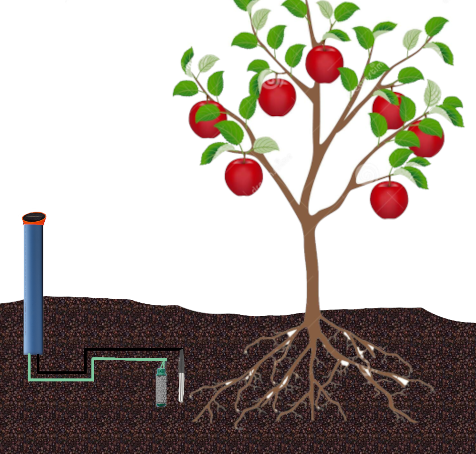</p>
<p style="text-align: center;">Figure : Soil sensor device deployment suggestion schematic.</p> 

1. The very first step is to prepare your Watermark SS200 sensors, the procedure is explained in the former bullet point.
2. In the field, place them diagonally in different locations. If you have drip irrigation, do not place them to close to the pipe with holes.
3. The sensors have to be placed in the depth of the main root zone, this differs as per crop. For single devices, do not place them too deep, because then they will react on changes very slowly.
4. Dig a hole in the ground at the specific depth. Put the excavated soil into the empty bucket. The hole should be wide to facilitate the PVC pipe and the sensors.
5. Now put some water into the bucket with the soil from the ground, then stir it. It needs to be a slurry substance, to make good contact with the sensors.
6. Place the sensors into the hole. Now cover sensors **and wires** with soil water mix. The cables need to be routed through the pipe.
7. Now place the PVC pipe also into the hole. Be careful not to push the edge of the pipe against the cables, this is also illustrated above.
8. Now put the sensor device into the PVC pipes top end. Align the solar panel in south direction. Be careful again when pushing the device inside the PVC tube. If it does not fit accurately, sand down the PVC pipe, not the case of the WaziSense.

After one week to two weeks time you can obtain accurate sensor readings.

Do not forget to read the official guide of the [Watermark 200SS installation guide](https://www.irrometer.com/pdf/701.pdf).

## Actuator
In the following it is being explained how an actuator can be used to perform automatic irrigations.

### Different modes of operation 

The application can be used with two different goals in mind.

**Decision Support System:** This is meant to be for farmers who want to be informed, about an efficient irrigation time to reduce plant stress and water needs at the same time.

**Automatic Irrigation System:** The automatic irrigation feature will automatically irrigate a plot when a certain (user set) threshold was met.

The different modes can be switched by defining an irrigation actuator device in the `Settings` menu.

### How to build an actuator

For the actuator you can use the WaziAct board or any LoRa enabled arduino board.

**Components:**

- **WaziAct** Board or any **LoRa** enabled Arduino board
- 868 Mhz dipole Antenna
- Wires and jumpers
- Waterproof WaziSense casing (contact us) or custom case
- FTDI connector + USB cable
- Powered via the grid: 
    - preferably via power outlet of the pump
- Powered via solar:
    - Solar panel 6 V, 1 W 
    - 18650 3,7V Li-Ion battery
    - 18650 battery holder

With those components the actuator can be assembled, in the following it is being indicated on how to do so.

**PIN configuration:**

The following section is related to the WaziAct board, it can also be used with any LoRa enabled Arduino board.
Connect the flow meter sensor cable, usually yellow, to the `D5` pin, the red positive power cable to `D6` pin and the black ground cable to `GND` pin. If you use an WaziAct, there is a LED included, internally wired to `D8` If you use a dedicated LED you can connect the positive lead to an arbitrary digital pin and the negative pin to ground. The battery voltage can be read on WaziAct with pin `A0`, research it if you use a different MCU. In terms of power supply we suggest using a [Hi-Link HLK-PM01 AC-DC 220 V to 5 V stepdown converter](), as it is cost effective and convenient to use. Be sure you know what you are doing, handling high voltages like 220V can be dangerous. It is also possible to power the WaziAct with a 5V USB power supply.

TODO: how to connect pump to relay? how to connect power to mcu?

### How to flash the firmware of an actuator

In this section the prerequisites and steps of flashing the automatic irrigation actuator are being explained.  

[Make sure you read this section first, because it covers the basics of flashing a firmware to an arduino mcu.](#how-to-connect-soil-sensor-devices-to-the-wazigate)

The firmware of the actuator is already prepared and just needs to be flashed to the arduino device, you can find it in the [WaziDev git repository.](https://github.com/Waziup/WaziDev/tree/master/examples/LoRaWAN/Irrigation) If you want to flash a WaziAct it is suggested to use: `WaziDev/examples/LoRaWAN/Irrigation/Pump_with_flow_meter_production_waziact
/Pump_with_flow_meter_production_waziact.ino`.

It can be flashed with the ArduinoIDE

Here you have to adjust the LoRa specific ABP information (in HEX format) like `LoRaWANkeys`and `devAddr`:

```
unsigned char LoRaWANKeys[16] = {0x23, 0x15, 0x8D, 0x3B, 0xBC, 0x31, 0xE6, 0xAF, 0x67, 0x0D, 0x19, 0x5B, 0x5A, 0xED, 0x55, 0x25};
unsigned char devAddr[4] = {0x26, 0x01, 0x1D, 0xE1};
```

Additionally it is needed to provide the PINs that the connection of the sensors was made to:

```
const int FlowMeterSensorDataPin = 5;
const int FlowMeterSensorPowerPin = 6;
const int ledPin = 8;
const int batt_pin = A0;
```

Another important point is that you have to adjust the **conversion factor** of the water flow sensor accordingly, this specifies how much water can run through the flow sensor in one revelation of the impeller. 

```
volatile float factor_conversion = 0.2;                // estimated for DN50
volatile float factor_conversion = 5.625;              // calculated for DN20
```


There are some presets in the script but you can adjust/calculate it on your own, to match your flow meters diameter, there are three methods to do so, they are explained in the following:

1. The Standard Formula (K-Factor): Most flow meters have a K-factor printed on the datasheet or the housing. The K-factor is usually expressed in Pulses per Liter (P/L). 
Example: If your DN20 meter says 450 pulses per liter:

```
                Frequency (Hz)
Flow (L/min) = ----------------
                K-Factor (P/L)
```

2. Manual Calibration (The "Bucket Test") 
Since pipe diameter (DN20 vs DN50) and pressure greatly affect accuracy, the most reliable way is manual calibration: 
Reset your NumPulses to 0.
Run water through the meter into a calibrated container (like a 10-liter bucket) until it is exactly full.
Read the total pulses (NumPulses) recorded by your code.
Calculate:
```
                  Total Pulses (NumPulses)
K-Factor (P/L) = ----------------------------
                      Volume (liters)
```

3. Estimates for DN20 - DN50
Flow meters vary by brand (e.g., Hall effect vs. Ultrasonic), but here are common starting points for standard plastic Hall-effect sensors: 

|Size	    |Typical K-Factor |Estimated `factor_conversion` |
| :---      |    :----:       |                         ---: |
|DN20 (3/4")|4.5 to 8	      |0.125 to 0.22                 |
|DN25 (1")	|1.0 to 3.5	      |0.28 to 1.0                   |
|DN50 (2")	|0.2 to 0.5	      |2.0 to 5.0                    |

Calculate:
```
                ( Frequency / K-Factor )
Flow (m3/min) = ------------------------
                        1000
```

Since after an potential update of the flow meter or an incorrect calculation/measurement the conversion factor could change, you can just update it via the WaziGates dashboard. Just click on the device, select the actuator (indicated by a robot arm) and send another `conversion_factor` via LoRa. No need to open the device and update it in the arduino code.

There are also confirmations for successful irrigations, the actuator will send back the given amount to the WazGate, after an irrigation was completed successfully.

TODO: show picture of device on dashboard

After all necessary modifications had been done you can flash the firmware and check whether the relay switches on after an downlink was send. Afterwards it is advised to confirm whether the relay switches the pump off after the flow amount was reached. Verify the calculated flow amount with a bucket test. The device logs the current and anticipated quantities in the serial monitor.

## Irrigation Prediction Application
After installing the application, you can observe it by clicking on the apps name in the side bar of the user interface.

### Setting up the application
The first step after [installing](#install-the-irrigation-prediction-application) and launching the application is to **run the setup**, press the gear icon (**`⚙`**) in the top right corner. The settings menu is separated in three section:

- **Soil**
- **Device**
- **Prediction and Scheduling**

The irrigation prediction application can survey and automatically irrigate multiple different plots with different characteristics at the same time. For each separate plot a specific configuration has to be saved, hence setting up each individual plot is required.

***Soil section:***

The soil tab covers all soil related aspects of the application. Below there is a screenshot of this section:
&nbsp;<p style="text-align: center;">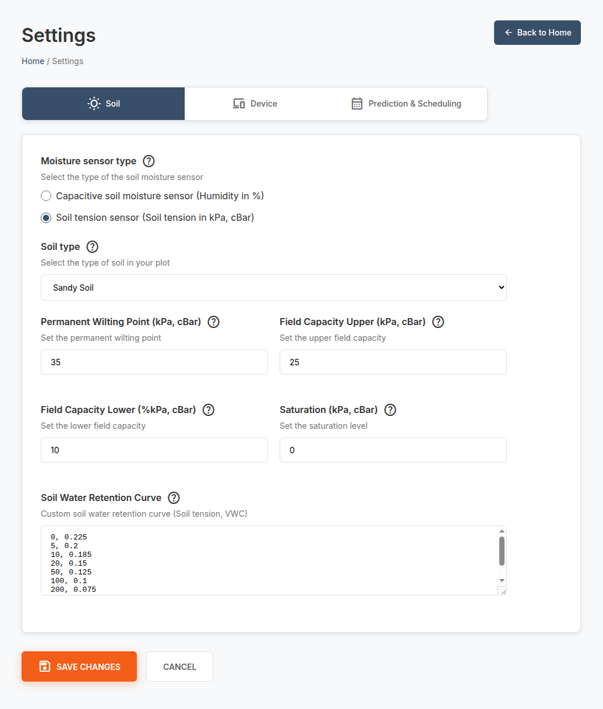</p>
<p style="text-align: center;"> Figure : Soil section of the settings page.</p> 

In the first option it can decided on the **sensor type**, volumetric water content sensors (returns the humidity in %) or soil tension sensors (returns humidity in kPa or cBar) are supported.

The next option includes presets for **soil types**, here you can choose between different soil types, which automatically fills the remaining sections on this page.

Settings those aspects manually is also possible:
 - **Permanent Wilting Point:** describes a upper bound at which plants can no longer extract water from the soil
 - **Field Capacity Upper:** maximum soil moisture content that your soil can retain
 - **Field Capacity Lower:** minimum soil moisture content that your soil can hold
 - **Saturation:** moisture content level for when the soil is fully saturated
 - **Custom Soil Water Retention Curve:** Here you can input soil water retention curve in key-value pairs to help in conversion accuracy to volumetric water content

**Device section:**

The second tab is the **device tab**, here the sensor devices have to be specified. In the following there is a visualization of the device section.
&nbsp;<p style="text-align: center;">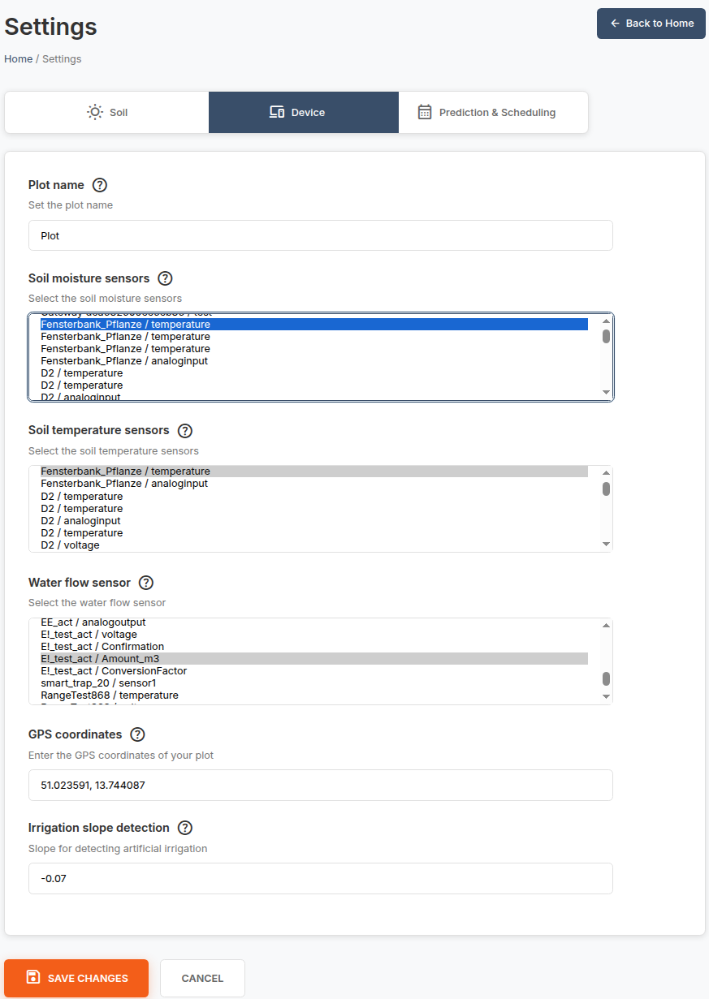</p>
<p style="text-align: center;"> Figure : Device section of the settings page.</p> 

On top a user can specify the name of the plot, this helps to identify the plot.

In the next section **soil moisture sensor** can be defined. Select one or more soil moisture sensors that monitor soil tension and are connected to your WaziGate. To select or deselect multiple sensors, hold down the **CTRL** key.

Below is the **soil temperature sensor** selection. Choose one or more sensors that measure soil temperature and are linked to your WaziGate. Use **CTRL** to select or deselect multiple sensors.

This is followed be the **water flow sensor** section. Here the sensor that monitors the water flow of your pump connected to WaziGate. Only one water flow sensor can be chosen.

Almost at the button the **GPS coordinates** have to be entered, this step is as crucial as the IoT sensors, the predictions of the application are heavily dependent on fetching weather forecasts.

If there is no pump specified, the system tries to judge when an **irrigation was given**, to decide there is a **adjustable slope** to detect the circumstance. Specify the slope to assist in detecting artificial irrigation. This option is needed only if no water flow sensor is added.

**Prediction and Scheduling section:**

The last tab is the **prediction and scheduling tab**, here the sensor devices have to be specified. In the following there is a visualization of the prediction and scheduling section.
&nbsp;<p style="text-align: center;">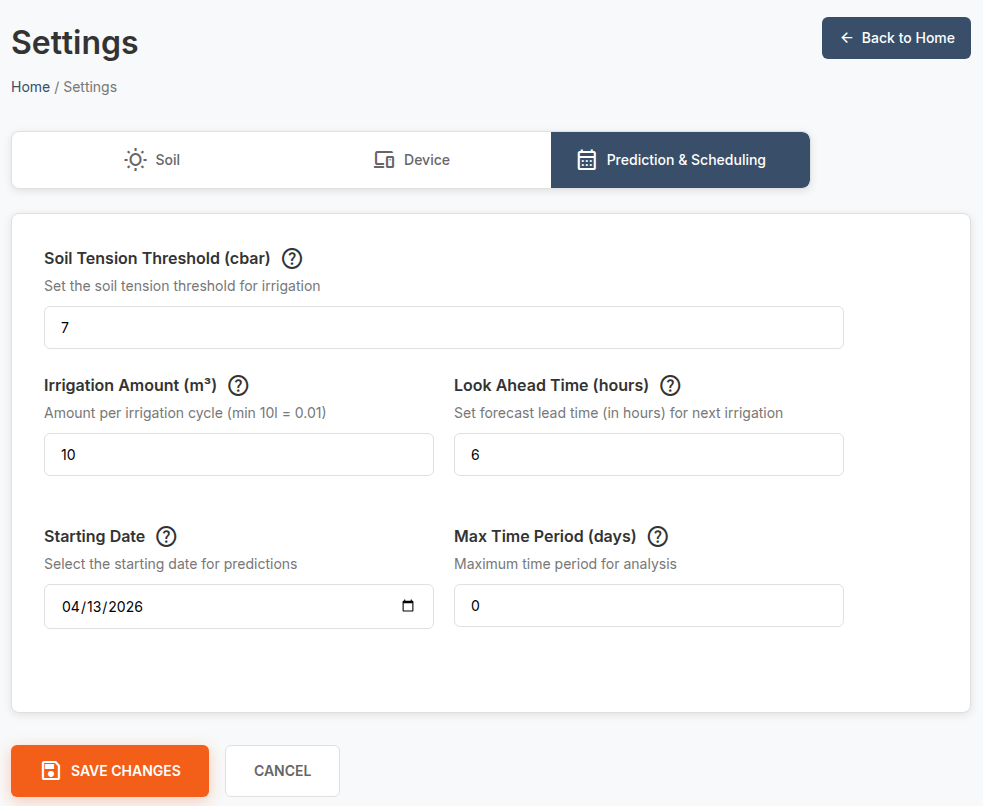</p>
<p style="text-align: center;"> Figure : Prediction and Scheduling section of the settings page.</p> 

On top the **soil tension threshold** in hPa or cBar is specified. When the soil is getting dryer that this threshold and there is no precipitation forecasted for next hours (this can be specified with the option: look ahead time), irrigation is being given.

The **irrigation volume** is meant for the specific plot in m³, not in mm, this would also make it necessary to include the area of the plot. Enter the volume of water in m³ (1 m³ = 1000 l) used for a single irrigation event.

Like mentioned before, with this option **forecast look-ahead time**, the number of hours the precipitation forecast should be taken into account, is set. If the soil tension reading is not below 20% of this threshold and there is a precipitation amount in the forecast. The system will skip the irrigation and wait for the natural precipitation.

When sensors are installed, they need to be primed and are inaccurate during early cycles. To not let the model learn from wrong readings the data can be omitted for the modelling process before a certain date. **Start date** selects the start date for sensor data to be included in model creation. It is recommended to allow a short warm-up period after sensor installation.

To ensure good resilience **maximum data duration** was included, in a long term deployment, circumstances might change over time, so old data might not be representative, to prevent this a user can specify a time span how many days in the past should be used as training data for the model. A value of zero mean it should use all the gathered training data after the starting date (defined before).

### Using the application

[After setting everything accordingly up.](#setting-up-the-application) Press the `Start Training` button, to let the application train and compare different machine learning approaches to find the best suiting one for the use case. The application will indicate the start and end of this training procedure with a message from your browser, it can take from 5 minutes - 1 hour. Afterwards the models/predictions are retrained/generated automatically in dynamic intervals for you.

The irrigation prediction application is enabled to manage a whole farm with several plots, they can be added with different configurations and sensors. In the application those views can be changed via the tabs that are located in the top part of the screen. New plots can be added via the `+ Add Plot` button, which can be found next to the configuration button on the right. Plots can be deleted by clicking on the `✖` symbol on the top right corner of the currently active tab (the active tab is indicated by a blue background). 

Below but still in the top section, there is the **sensor overview**. Here real-time soil temperature and soil tension and humidity data from connected sensors is averaged and shown. As shown in the figure below.
&nbsp;<p style="text-align: center;">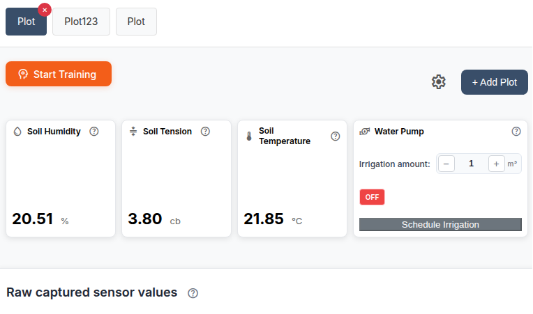</p>
<p style="text-align: center;"> Figure : Top section with tabs, menu and live data from sensors and actuators.</p> 

On the right hand side there is the **pump section**, it is active when you specified an actuator to perform the irrigation in the device tab of the configuration. If you have an actuated pump or a solenoid valve specified, manual irrigations can be initiated with an arbitrary quantity (in m³). 

Below, there are three charts that show:
- **sensor data**
- **training data**
- **predictions**

In the bottom of each individual chart, different parameters can be selected and deactivated to be shown/rendered. Additionally start and end date can be adjusted by zooming into the chart to get more detail in a certain time period. In the three bar menu on the right top of the bar, the data can be downloaded in different formats.

The first diagram shows **historical sensor values**, it renders the averaged value of all sensors of the same type, here soil tension and soil temperature is shown.
&nbsp;<p style="text-align: center;">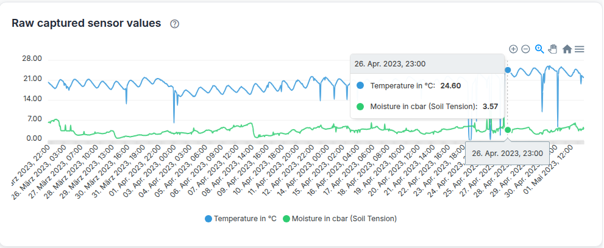</p>
<p style="text-align: center;"> Figure : Averaged data accumulated by all soil moisture sensor devices that have the same type.</p> 

The second chart shows **all inputs for the machine learning model**, already cleaned, sampled and prepared. Here certain trends can be visualized/analyzed and how they interlink to other parameters. The features that are shown here are either engineered variables or external data retrieved from a weather services API. An overview of this chart is illustrated in the figure below.
&nbsp;<p style="text-align: center;">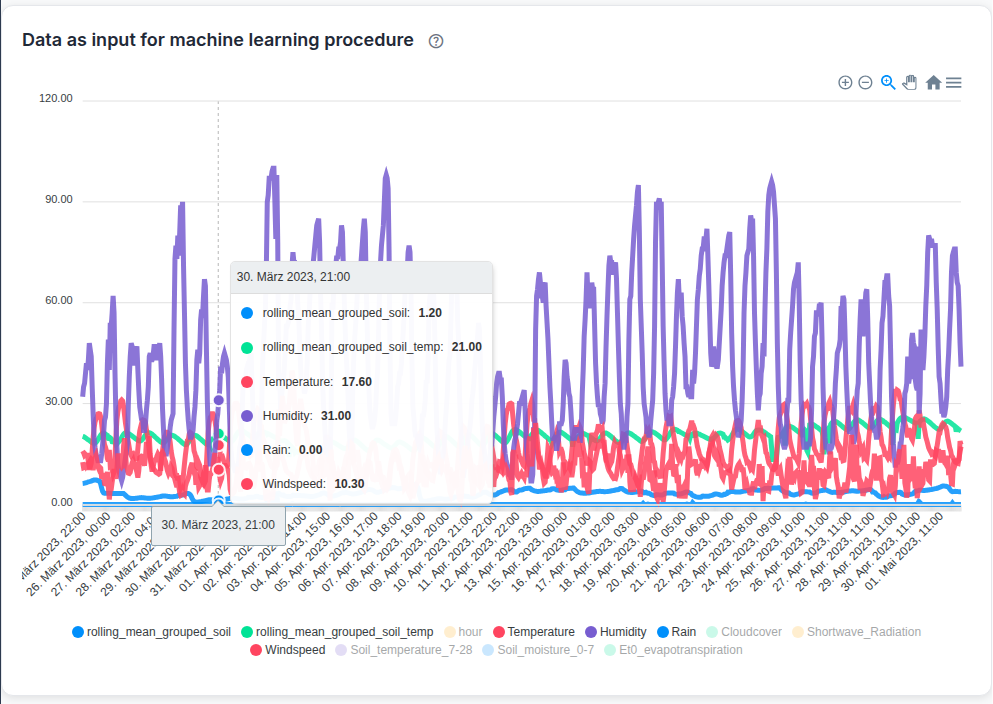</p>
<p style="text-align: center;"> Figure : Data used by the machine learning algorithm, includes sensor data, engineered features and weather data.</p> 

The last chart shows the **predictions for the upcoming week**. It shows the moisture content of the soil as tension and as volumetric water content (VWC), this is realized with help of the soil water retention curve. If the sensor type is a VWC sensor, then it is only shown in VWC. Vertical lines indicate the next days. Vertically separated lines and areas indicate soil moisture levels for the specific soil type that had been set in the settings menu. A figure below gives a visual representation of the chart.
&nbsp;<p style="text-align: center;">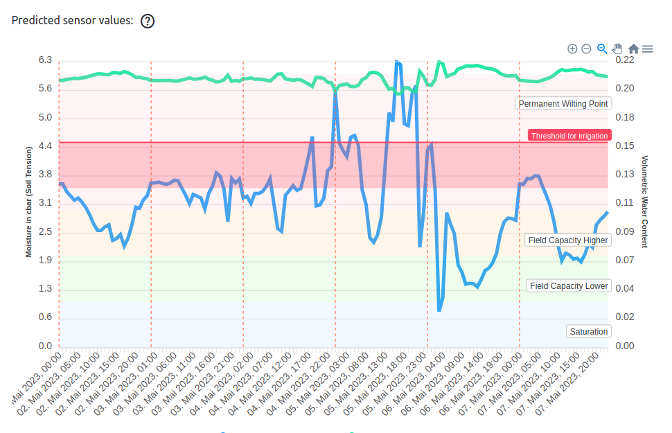</p>
<p style="text-align: center;"> Figure : Predictions for the upcoming days. Labels are explained above. </p> 

The last aspect of this page is the **predicted irrigation time**, it shows a timestamp when the next irrigation is likely to happen, this happens when the threshold is met and there is no precipitation expected in the upcoming hours. 

## Maintenance  
This sections explains how to check gateway, sensor devices and app status.

### Gateway
Check the gateway regularly by visiting the UI, it should be accessible. If not restart the gateway by cutting the power and let it reboot. After a reboot visit the UI and check whether the application is running and whether there is a config, if necessary press the `Start training` button to create predictions.

### Sensor devices
1. To check if the sensor devices work properly you can observe the WaziGates dashboard. In the dashboard view you can see whether sensors send regularly messages. The messages should be received in the preset intervals, that were defined in the arduino script. 

### App status
Visit regularly the the UI of the application and interpret the data. Also have a visual check whether plants that you grow in that plot are healthy/with good nutrition and not infected by any diseases. Since this application does not visually check the health of the plants in the plot, human intervention is necessary to check on the status of the plants.

## Troubleshooting
Error Messages: 
- TODO: Error messages should be explained here

If you have any further questions/problems, please do not hesitate to contact us.
You can reach out to us at contact@waziup.org. 

## Tooltips from inside the Application

All aspects of the application are explained with tooltips, the tooltips are printed below. In the app they are indicated by a question mark (`?`), just hover it with your mouse to see the tooltips.

### Tooltips of the main screen
- ***Sensor Overview***: Displays real-time data from connected sensors.

- ***Manual Irrigation Control***: Allows manual triggering of irrigation.

- ***Historical Data Chart***: Displays raw sensor data, with a 1,000-element limit for faster performance.

- ***Training Data Chart***: Shows the full data set used to train the machine learning model.

- ***Prediction Chart***: Provides the latest soil tension forecast for the upcoming week.

### Tooltips of the settings section

In the following different aspects and forms of the application are explained. This information is also available via tooltips, just hover the question mark to observe them. 

- ***Soil Moisture Sensor Selection***: Select one or more soil moisture sensors that monitor soil tension and are connected to your WaziGate. To select or deselect multiple sensors, hold down the **CTRL** key.

- ***Soil Temperature Sensor Selection***: Choose one or more sensors that measure soil temperature and are linked to your WaziGate. Use **CTRL** to select or deselect multiple sensors.

- ***Water Flow Sensor***: Select the sensor that monitors the water flow of your pump connected to WaziGate. Only one water flow sensor can be chosen.

- ***GPS Coordinates***: Enter coordinates to fetch relevant meteorological data from online sources.

- ***Slope Detection***: Specify the slope of your field to assist in detecting artificial irrigation. This option is needed only if no water flow sensor is added.

- ***Irrigation Volume***: Enter the volume of water (in liters) used for a single irrigation event.

- ***Forecast Look-Ahead Time***: Set the number of hours ahead for which you want soil tension forecasts.

- ***Data Start Date***: Select the start date for sensor data to be included in model creation. It is recommended to allow a short warm-up period after sensor installation.

- ***Maximum Data Duration***: Enter the maximum period (in days) of data to include in the model.

- ***Soil Type***: Choose the soil type that best matches your field’s composition.

- ***Soil Water Retention Data***: Input soil water retention curve data in key-value pairs to help in conversion accuracy to volumetric water content.

- ***Permanent Wilting Point (PWP)***: Enter the soil moisture content at which plants can no longer extract water from the soil.

- ***Field Capacity Upper Limit (FCU)***: Input the maximum soil moisture content that your soil can retain.

- ***Field Capacity Lower Limit (FCL)***: Input the minimum soil moisture content that your soil can hold.

- ***Soil Saturation (SAT)***: Enter the moisture content level for when the soil is fully saturated.

- ***Soil Tension Threshold***: Specify the threshold for soil tension, measured in cbar or hPa, to guide irrigation decisions.

## FAQ
**Q:** How frequently should I re-train the model? 

&emsp;**A:** This option is hidden from the user, the interval is setup dynamically for you. There is no way to alter this value in the configuration.

**Q:** Can I use different types of sensors?

&emsp;**A:** Soil tension sensors and volumetric water content (VWC) sensors are supported.

**Q:** How do I access historical sensor values?

&emsp;**A:** Via the Dashboard of the WaziGate or inside the Application, after you run the configuration.

**Q:** What is the approximate training time.

&emsp;**A:** Training usually takes 5-60min for one plot, it depends on the amount of data and the complexity of the best model.

**Q:** Can I have an influence on or adjust the model parameters?

&emsp;**A:** The hyperparameters and all other parameters relevant for machine learning are chosen and tuned automatically by the system and cannot be changed by a user. There are other aspects that will change the models behavior those can be altered in the settings menu.
